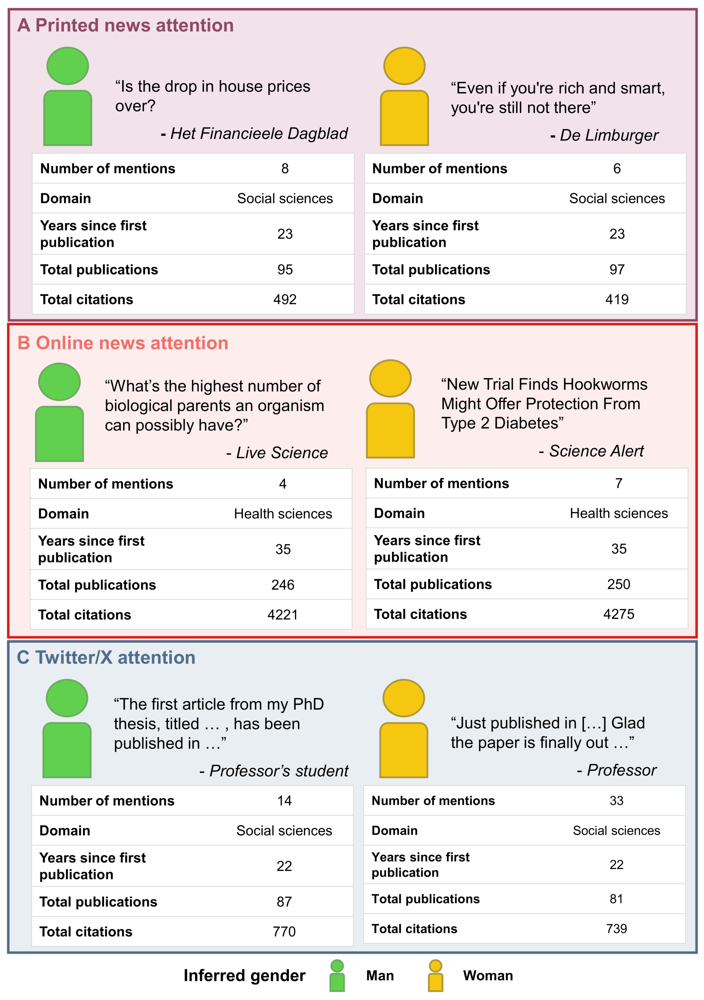
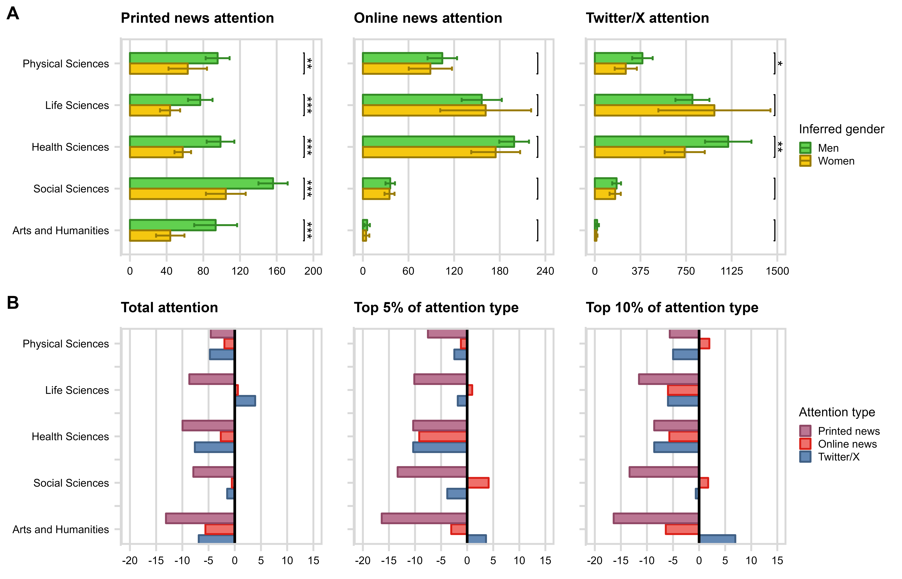
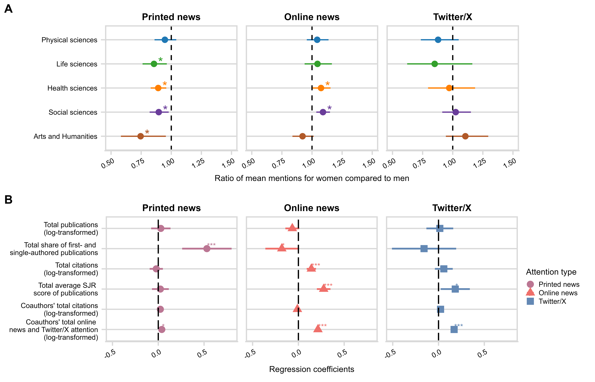

<style>
body {
text-align: justify}
</style>

```{r, install remotely, globalsettings, echo=FALSE, warning=FALSE, results='hide'}
# install.packages("remotes")
#remotes::install_github("rlesur/klippy")
``` 

```{r, globalsettings, echo=FALSE, warning=FALSE, results='hide'}
library(knitr)

opts_chunk$set(echo = TRUE)
opts_chunk$set(tidy.opts=list(width.cutoff=100),tidy=TRUE, warning = FALSE, message = FALSE,comment = "#>", cache=TRUE, class.source=c("test"), class.output=c("test2"))
options(width = 100)
rgl::setupKnitr()

colorize <- function(x, color) {sprintf("<span style='color: %s;'>%s</span>", color, x) }

```

```{r klippy, echo=FALSE, include=TRUE}
klippy::klippy(position = c('top', 'right'))
#klippy::klippy(color = 'darkred')
#klippy::klippy(tooltip_message = 'Click to copy', tooltip_success = 'Done')
```


----

:::::::::::::: {.columns}
::: {.column width="70%"}

# The Limit to Gender Equity in Science Communication  
</br>

#### This is the companion website to the following paper:  

#### **Macanovic, A., Hofstra, B. (2025). "The Limit to Gender Equity in Science Communication".**  

#### Gender inequities in science go beyond disparities in scientific prominence, extending to visibility in public domains. Public scientists wield considerable power over what the public sees, reads, and understands about science, yet we know little about the presence of men and women scientists in different types of media. Longitudinal analyses of all Dutch full professors show that women scientists are underrepresented in printed news. Although women and men full professors are equally present in online news and social media, women full professors are mentioned by name less on these platforms. While women full professors’ representation online is encouraging, persistent underrepresentation in printed news perpetuates gendered perceptions of science by the public, hindering women scientists’ careers and limiting their influence.  
</br>

### Paper overview

We compile the Dutch Professors in Media database (DPM): a newly curated and fine-grained longitudinal dataset, containing nearly all full professors in the Netherlands (N = 6.830) as of 2022 across all academic fields. Uniquely, we link all these professors to detailed, time-stamped accounts of attention across a variety of media types. From LexisNexis, for instance, we retrieve 721 thousand mentions of professors in printed news media (e.g., The New York Times). Using the Altmetric database, we capture 695 thousand online news (e.g., Yahoo! News) and blog (e.g., Psychology Today) articles, and 3.3 million social media posts (on Twitter, now X) containing mentions of professors’ scientific work. Figure 1 depicts case examples of printed news, online news, and Twitter/X attention received by relatively comparable men and women full professors in our dataset.  
</br>

<center>
{width=460px, height=560px}\
<font size="1"> *Fig. 1.* Examples of printed news (Panel A), online news (Panel B), and Twitter/X (Panel C) attention given to full professors in our dataset. Within each attention type, we choose different example pairs of men and women professors matched on scientific field, years since the first publication, total publications, total citations, and the number of mentions from the focal attention type in 2023. We show examples of (online) news article headlines – alongside the news outlets that published them – and the authors and content of Twitter/X posts that mentioned these professors or their scientific work. Note that we translate titles in Dutch and paraphrase sentences and posts in English.
</font>
</center>  \

We evaluate the representation of women full professors’ attention in offline and online media. We do so by looking at printed news outlets, online news, and Twitter/X. We group professors by field (Physical, Life, Health, and Social Sciences, and Arts and Humanities) and analyze each field separately, as different fields have different publication norms and audiences and prioritize dissemination to different extents. \

Women full professors are, on average, mentioned significantly less compared to men. Figure 2A depicts that this difference at the expense of women persists in all fields (at least p two-sided < 0.05). Gender differences in received attention also persist in most fields, and across most printed news source types, including national and international news outlets and Dutch local news publications (SI Appendix). Women also receive less online news attention. Yet, we find no evidence of statically significant differences in attention received by men and women when we break this down by different fields (Figure 2A, p two-sided > 0.05), or different online news sources (SI Appendix). Finally, women full professors receive significantly fewer mentions on Twitter/X compared to men (p two-sided < 0.05, Table S7). This gender difference is driven by full professors in physical and health sciences (Figure 2A). 

In Figure 2B, we show the difference between the share of women full professors within each field and their share in (i) the total number of mentions as well as their share among those in the (ii) top 5% or (iii) top 10% of all full professors by mentions received (broken down by the media domain where they are mentioned). Overall, we see that relative to their share among full professors, women capture a disproportionally small share of printed media attention in all fields, especially when it comes to being included among the scientists in the top 5% of attention captured. In most fields, we find similar patterns for online news and Twitter/X, with the exception of some cases where women professors comprise a higher than proportionate share of professors capturing top 5 and 10% of online news and Twitter/X attention (i.e., particularly women full professors in social sciences in online news and in arts and humanities on Twitter/X). 


<center>
{width=600px, height=400px}\
<font size="1"> *Fig. 2.* Average mentions (with error bars denoting 95% CIs) accumulated by men and women full professors over their scientific careers until 2023 (Panel A). Comparisons indicate results of two-tailed t-tests comparing means within fields, with * p < 0.05, ** p < 0.01, *** p < 0.001. Below, we show the under- or overrepresentation (in percentage points, compared to their share in the professoriate) of women professors in (i) total attention received by all professors; (ii) among professors who capture top 5% or (iii) top 10% of printed news, online news, or Twitter/X attention within their field (Panel B).
</font>
</center>  \

Are gender differences in media attention driven by academic careers and networking dynamics? To estimate gender inequality net of such confounders, we perform a series of pooled regressions for each field and media type with standard errors clustered at the professor level. Figure 3A plots the results of these analyses as the difference in (geometric) means of media attention received by women compared to men.  

A few major findings merit attention. First, women receive significantly less attention in printed media than men in all fields but physical sciences in our regression models net of all confounders. These differences persist across dependent variable specifications (e.g., excluding digital online editions of printed news, and across different regression model specifications, Online SI). As printed news mentions always include professors’ full names, we conclude that men full professors’ direct expertise is more sought after and their work directly linked to them more often in both general-interest and specialist printed news outlets. 

Second, online news and Twitter/X attention are more equally distributed between men and women full professors. While we do see that women full professors receive significantly more online news attention in health and social sciences, these effects do not persist across all alternative dependent variable specifications: when considering attention to single-author publications only, the effect only persists in social sciences but disappears altogether once we consider only those online news articles that explicitly mention full names (Online SI). These findings support the conjecture that online news and social media equalize attention received by men and women, while suggesting that gatekept printed news attention stratifies professors at the expense of women. 

<center>
{width=66px, height=400px}\
<font size="1"> *Fig. 3.* Regression model results. Panel A shows ratios of geometric means of yearly printed news, online news, and Twitter/X mentions for men and women full professors as per our linear models. Panel B shows regression coefficients for selected independent variables for models with different media attention types as dependent variables within physical sciences as an exemplary field. Stars indicate statistical significance of regression coefficients with * p < 0.05, ** p < 0.01, *** p < 0.001.
</font>
</center>  \


Full professors’ scientific productivity, prominence, and the features of collaborators in their network have the lowest explanatory power when it comes to printed news and the highest explanatory power when it comes to online news attention. Such variation between fields and media attention points to differences in how scientific expertise is sought out by different kinds of media.  

<br/>

### Repository Description  

Last compiled on `r format(Sys.time(), '%B %d, %Y')`

<br/>

#### Dutch Professors in Media (DPM)
This website documents the preparation of the Dutch Professors in Media database (DPM): 
a newly curated fine-grained data source containing nearly all full professors in the 
Netherlands (N = 6.830) as of 2022 across all academic fields. 

This database contains information on professors' publication, citation, affiliation, and topical interest records from [OpenAlex](https://openalex.org/). We enrich these data with funding received by both the Dutch [(NWO)](https://www.nwo.nl/) and the European [(ERC)](https://erc.easme-web.eu?mode=7&countries=NL) Research Councils, as well as information on positions held within the Dutch government or its advisory bodies.

Uniquely, we link professors to detailed, time-stamped accounts of attention across a variety 
of media types. From [LexisNexis](https://www.lexisnexis.com/) we retrieve 721 thousand mentions of professors in printed news media (e.g., The New York Times). Using the [Altmetric database](https://www.altmetric.com/), we capture 695 thousand online news (e.g., Yahoo! News) and blog (e.g., Psychology Today) articles and 3.3 million social media posts (on Twitter, now X) containing mentions of professors’ scientific work. 

Finally, we compile social network data on 1.35 million co-authors of professors in the DPM, collecting information on co-authors’ publications, citations, and the number of times their work appeared in the online news and online social media (Twitter/X). 

Most of the scripts used in the preparation of this database can be found in the top
menu under the section *"DPM preparation"*.

The database was compiled by [Ana Macanovic](https://amacanovic.github.io/) and [Bas Hofstra](https://www.bashofstra.com) at [Radboud University](https://www.ru.nl/en).

<br />

#### DPM Panel dataset

This website further contains scripts that use DPM to prepare a panel dataset
compiling indicators of professors' scientific careers, media attention, and collaboration
networks on the yearly basis, covering the time span between 2012 and 2023.

The script used to compile this panel dataset from the DPM can be found in the top
menu under the section *"DPM Panel dataset"*.

<br />

#### Analyses and Results

This section of the website contains scripts that produce results found in the 
main text and the Online SI of the paper.

- Scripts scripts used to generate the results in the main text and parts of the Online SI can be found in the top
menu under the section *"Analyses and Results"*.

- Additional robustness checks can be found in the top
menu under the section *"Robustness checks"*.

- Full tables for all the regression models in our main text and the Online SI can be found [here](https://amacanovic.github.io/limits_gender_equity/Analyses_robustness.html).

- Content of chapter S6 in the Online SI can be found in the top menu under the section *Analyses of the additional sample (N = 980)*.


----


:::
::: {.column width="80%"}


:::
::::::::::::::


----


